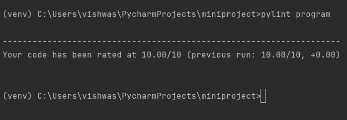
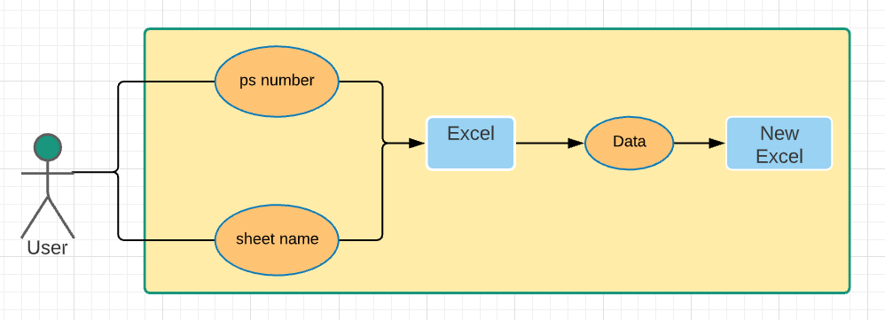
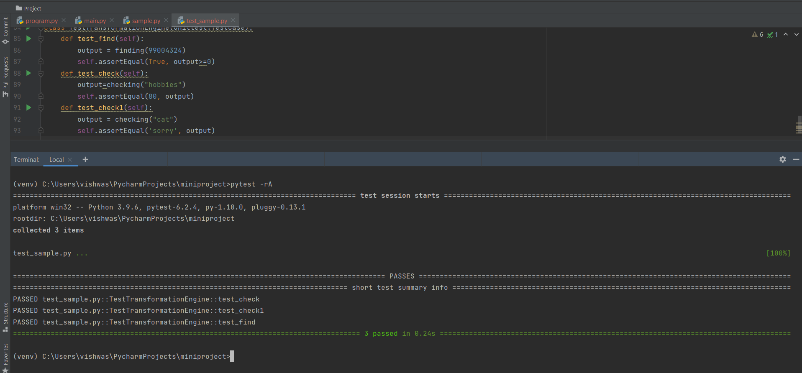

# ***Vishwas_python_miniproject_259036***

## **working with excel sheets**

---
- Microsoft excel is used to store data.
- Excel files have ability to store large content of data.
- At some times people needs particular data for their works.
- The program in this project performs copying of specified data from particular excel sheet.

## ***pylint***

---
Figure shows the pylint results.

## ***Use Case Diagram***

case diagram of project is shown below.

## ***Pytest***
Figure shows pytest results of the program.

